# 深入理解计算机系统

## 计算机系统漫游

有如下源代码 `helloworld.c`

```
#include<stdio.h>
int main(){
printf("hello, world!");
return 0;
}
```

## 信息就是位+上下文

源程序是0和1组成的位(又称之为比特bit)序列，8个位被组织成一组，称之为字节Byte。

``1Byte=8bit, 1KB=1024Byte, 1M=1024KB, 1G=1024M, 1G=1024*1024*1024Byte=10^9Byte``

每个字节表示程序中的某些文本字符。

大部分的现代计算机系统都使用ASCII标准来表示文本字符。

**总结:** `helloworld.c` 程序是以字节序列的方式存储在文件中的，这种表示方法说明了系统中的所有信息(包括磁盘文件、内存中的程序、内存中存放的用户数据以及网络上传送的数据)，都是由一串比特表示的。

## 程序被其他程序翻译成不同格式


### 预处理阶段

预处理器(cpp)根据以#开头的命令，修改原始C程序。比如hello.c中第1行的 `#include<stdio.h>` 命令告诉预处理器读取系统头文件 `stdio.h` 
的内容，并把它直接插入程序文本中。结果就得到了另一个C程序，通常以 `.i` 作为文件扩展名。

``gcc -E helloworld.c -o helloworld.i``

### 编译阶段

编译器(ccl)将文本文件 `helloworld.i` 翻译成文本文件 `helloworld.s`
，它包含一个汇编语言程序。该程序包含函数main的定义，其中的每一条语句都以一种文本格式描述了一条低级机器语言指令。汇编语言为不同高级语言的不同汇编器提供了通用的输出语言。例如C编译器和Fortran编译器产生的输出文件用的都是一样的汇编语言。

``gcc -S helloworld.i -o helloworld.s``

### 汇编阶段

汇编器(as)将 `helloworld.s` 翻译成机器语言指令，把这些指令打包成一种叫做 `可重定位目标程序(relocatable object program)` 的格式，并将结果保存在目标文件 `helloworld.o`
中。 `helloworld.o`
文件是一个二进制文件，它包含的17个字节是函数 `main` 的指令编码。

``gcc -c helloworld.s -o helloworld.o``

### 链接阶段

`helloworld.c` 程序中调用了 `printf` 函数，它是C编译器提供的标准C库中的一个函数。 `printf` 函数存在于一个名为 `printf.o`
的单独的预编译好了的目标文件中，这个文件需要用某种方式合并到我们的 `helloworld.o`
程序中。链接器(ld)就是负责处理这种合并，最后会得到hello可执行文件。

``gcc helloworld.o -o helloworld``


GUN项目组成

- Linux内核
- Emacs编辑器
- Gcc编译器
- Gdb调试器
- 汇编器
- 链接器
- 处理二进制文件的工具以及其他一些部件

## 了解编译系统如何工作有何益处

- 优化程序性能
- 理解链接时出现的错误
- 避免安全漏洞

## 处理器读并解释存储在内存中的指令

### Shell是什么？

命令行解释器，输出一个字符，等待输入一个命令行，然后执行这个命令  
如果输入命令行的第一个单词不是一个内置的shell命令，那么shell就会假设这个是个可执行文件的名字，会加载并运行这个文件

### 系统的硬件组成

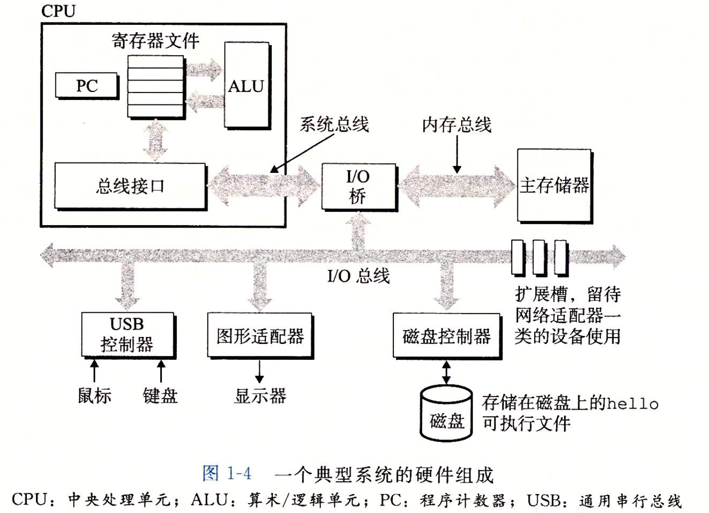

- 总线
  贯穿整个系统的一组电子管道，它携带信息字节并负责在各个部件之间传递。通常总线中传输的是固定长度的字节块，也就是字（word）。字中的字节数（字长）是一个基本的系统参数。不同系统字长不同。比如32位系统的字长为4个字节，64位系统的字长为8个字节。

- I/O设备 系统和外部世界的联系通道，包括用户输入的键盘和鼠标，用户输出的显示器，长期存储数据和程序的磁盘驱动器。I/O设备需要控制器或适配器和I/O总线相互连接。  
  控制器是I/O设备本身或者系统的主印刷电路板上的芯片组  
  适配器是一块插在主板插槽上的卡  
  控制器和适配器的功能都是在I/O总线和I/O设备之间传递信息

- 主存 临时的存储设备，处理器在执行程序时，用来存放程序和程序处理的数据  
  物理上由动态随机存取存储器(DRAM)芯片组成  
  逻辑上是线性字节数组，每个字节都有唯一的地址(数组索引)，地址从零开始。

- 处理器 解释或者执行存储在主存中指令的引擎，核心是大小为一个字的存储设备(寄存器)，成为程序计数器(PC)，任何时刻，PC均指向主存中的某条机器语言指令  
  处理器从系统通电开始一直不断执行程序计数器指向的指令，再更新程序计数器，指向下一条指令。看上去是一个指令执行模型操作的，模型由 `指令集架构` 决定    
  处理器围绕主存、寄存器以及算术/逻辑单元(ALU)进行
    - 加载：从主存复制一个字节或者一个字到寄存器，覆盖寄存器原来的内容
    - 存储：从寄存器复制一个字节或者一个字到主存某个位置，覆盖这个位置原来的内容
    - 操作：把两个寄存器的内容复制到ALU，然后ALU会对两个字做算术运算，并将结果存放到一个寄存器中，覆盖该寄存器中原来的内容
    - 跳转：从指令本身中抽取一个字，并将这个字复制到程序计数器，覆盖PC中原来的值

### 运行hello程序

## shell读取hello字符串

shell读取我们从键盘上输入的字符串 `./hello` 之后，计算机中的信息流如下图红线所示  
shell程序需要把用户输入的内容作为一个变量使用，这个变量在内存中一定会有个地址，因此它最终会达到主存，信息流如下  
键盘 -> USB控制器 -> I/O总线 -> I/O桥 -> 系统总线 -> 寄存器 -> 系统总线 -> I/O桥 -> 内存总线 -> 主存

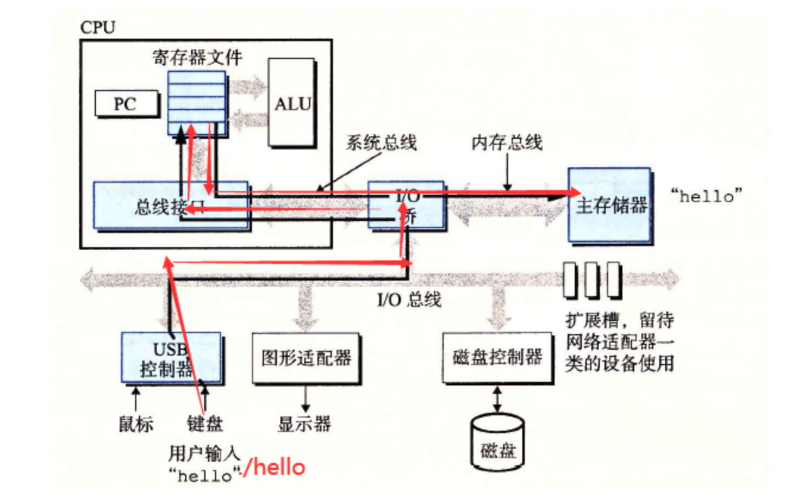


## 主存加载hello程序

在键盘敲击回车键，shell程序知道我们结束了命令的输入，shell会执行一系列的指令来加载可执行的hello文件，这些指令会将hello目标文件中的 `代码和数据从磁盘复制到主存` ,数据包括最终会被输出的字符串 `hello world`
,信息流如下

磁盘 -> 磁盘控制器 -> I/O总线 -> I/O桥 -> 内存总线 -> 主存

这种访问数据的方式，数据不会经过CPU，而是直接从磁盘到主存，这种方式称为DMA  
DMA直接存储器访问，有利于减轻CPU负荷，使得CPU可以在数据转移的同时做其他任务

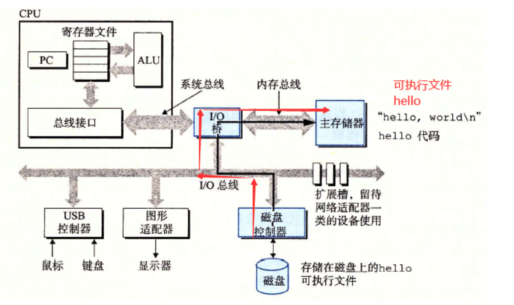

## 显示hello程序执行结果

加载完hello文件后，CPU从hello程序的主函数处执行指令，这些指令将 `hello world字符串中的字节从主存复制到寄存器文件，再从寄存器文件中复制到显示设备`,最终会显示在屏幕上，信息流如下

主存 -> 寄存器 -> 系统总线 -> I/O桥 -> I/O总线 -> 图形适配器 -> 显示器

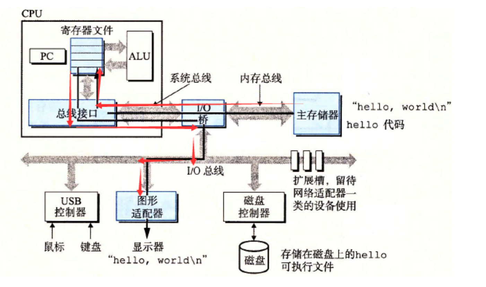

## 高速缓存

上面运行的hello程序，可以看到指令和数据需要多次在寄存器、主存、磁盘之间来回复制，这些复制就是开销，减慢了程序的工作速度，使用 `高速缓存存储器` 可以解决这个问题

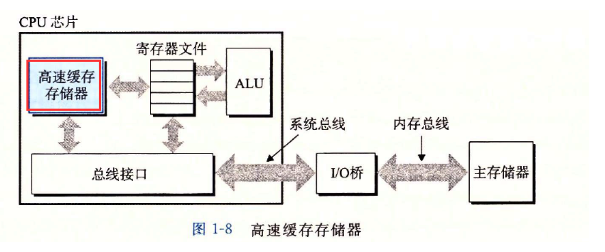

L1高速缓存的容量可以达到 `数万字节`,访问速度几乎和访问寄存器文件一样快

L2高速缓存容量为 `数十万到数百万字节`,通过一条特殊的总线连接到处理器，进程访问L2高速缓存的时间要比访问L1高速缓存的时间长5倍，但是仍然比访问主存的时间快5～10倍

L1和L2高速缓存是用一种叫做 `静态随机访问存储器(SRAM)` 的硬件技术实现的

高速缓存局部性原理： 程序具有访问局部区域中的数据和代码的趋势，因此高速缓存存储器作为暂时的集结区域，存放处理器近期可能会需要的信息

## 存储设备的层次结构

至上而下，设备的访问速度越来越慢、容量越来越大，并且每个字节的造价也越来越便宜。寄存器文件在层次结构中位于最顶部，也就是第0级或记为L0

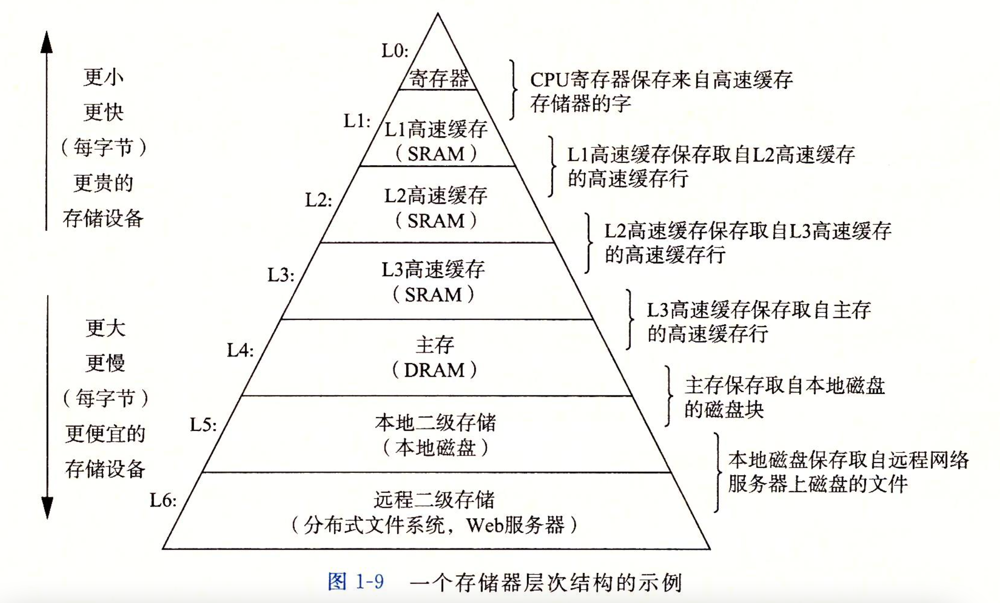

存储器层次结构的主要思想是上一层的存储器作为低一层存储器的高速缓存。因此，寄存器文件就是L1的高速缓存，L1是L2的高速缓存，L2是L3的高速缓存，L3是主存的高速缓存，而主存又是磁盘的高速缓存。  
某些具有分布式文件系统的网络系统中，本地磁盘就是存储在其他系统中磁盘上的数据的高速缓存

## 操作系统管理硬件

操作系统是应用程序和硬件之间插入的一层软件。所有应用程序对硬件的操作尝试都必须通过操作系统。


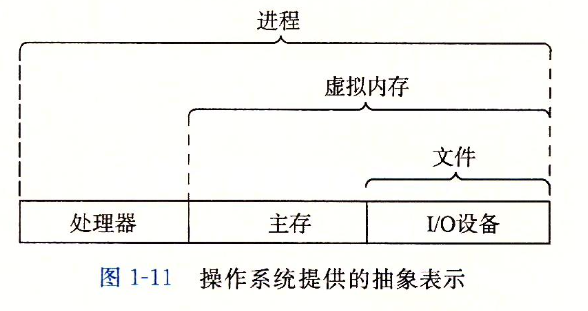

操作系统的两个基本功能

- 防止硬件被失控的应用程序滥用
- 向应用程序提供简单一致的机制来控制复杂而又通常大不相同的低级硬件设备  
  操作系统通过几个基本的抽象概念(进程、虚拟内存、文件)来实现这两个功能

# 进程&线程

进程是操作系统对一个正在运行的程序的一种抽象,一个系统上可以 `同时运行多个进程` ，每个进程都好像在 `独占地使用硬件` 。

**并发运行** 是说一个进程的指令和另一个进程的指令是交错执行的

上下文：操作系统保持和跟踪进程运行所需的所有状态信息(PC值，主存的内容等)

上下文切换：操作系统通过控制处理器在 `进程间切换` 以达到交错执行的目的

从一个进程到另一个进程的转换是由操作系统内核管理的，内核是操作系统代码常驻主存的部分，内核不是一个独立的进程，它是系统管理全部进程 `所用代码和数据结构的集合` 

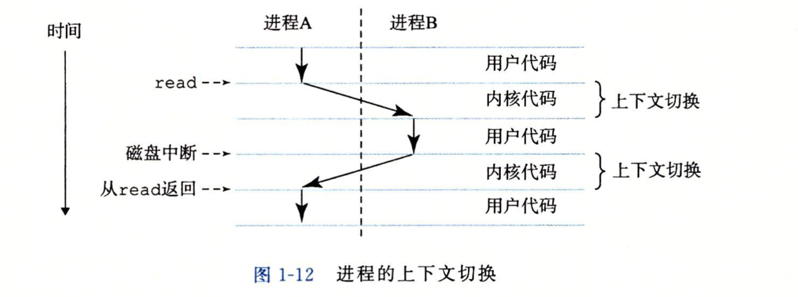

一个进程是由多个称为线程的执行单元组成，`每个线程都运行在进程的上下文中，并共享同样的代码和全局数据`。多线程比多进程更容易共享数据，而且线程间切换所有的开销远小于进程切换

# 虚拟内存

虚拟内存是一个抽象概念，为每一个进程提供了一个假象，`每个进程都在独占地使用主存`。每个进程看到的内存都是一致的，称为 `虚拟地址空间`

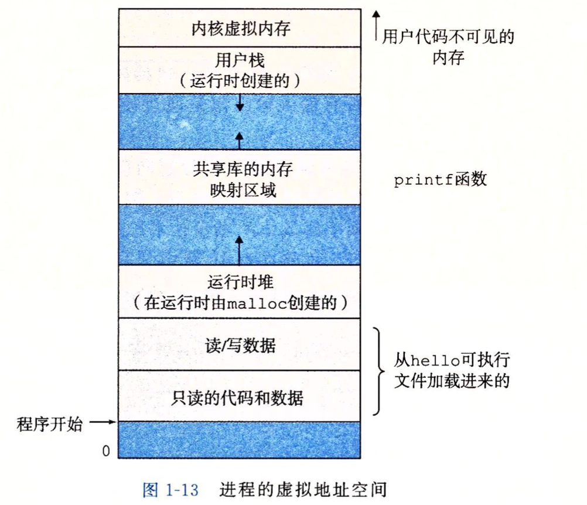

虚拟地址空间分为了若干个部分，并用 `箭头表示该部分的扩展方向` ，最下端地址为0，向上地址逐渐增长，每个部分的作用如下：

- 程序代码和数据：存放可执行程序代码和代码中的全局变量
- 堆：代码和数据区后紧随着的是运行时堆，用于动态申请的内存变量，比如malloc函数申请的动态内存空间，可以向上扩展
- 共享库：用于存放C语言库函数的代码和数据。本例中即printf的代码和数据
- 栈：位于虚拟地址空间的顶部，用于函数调用、存放局部变量等。当我们调用一个函数时，栈会向下扩展，返回时，向上收缩
- 内核虚拟内存：地址空间顶部的区域是为内核保留的。不允许应用程序读写这个区域的内容或者直接调用内核代码定义的函数。相反，它们必须调用内核来执行这些操作。对于一个64位的操作系统来说，用户空间为0-3G,内核空间为3G-4G

# 文件

文件实质上是字节序列，计算机上的I/O设备，包括磁盘、键盘、显示器、网络等都可以看成文件

操作系统将所有的I/O设备看成是文件，文件是字节序列，系统中所有的输入输出可以调用系统函数(`Unix I/O系统函数调用读写文件`)来读写文件实现来实现的

# 网络

从一个单独的系统来看，网络可以看成是一个I/O设备

当操作系统从主存复制一串字节到 `网络适配器` 时，计算机会自动将其发送到另一台机器

# 并发和并行

- 并发Concurrency：单核CPU同一时刻只有一条指令执行，但很多个进程指令被快速轮换执行，使得宏观上具有多个进程同时执行的效果。但是微观上并不是同时执行的，只是在一定的时间片里，快速交替执行多个进程

  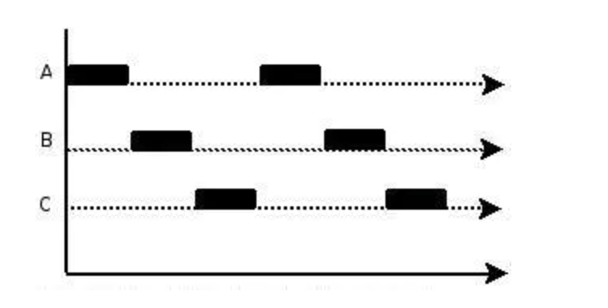


- 并行Parallelism：同一时刻，有多条指令在多个处理器上同时执行。若系统内只有一个 CPU，对于多线程任务，这些任务不可能真实并行的，因为一个 CPU
  一次只能执行一条指令，这种情况下多线程或者多线程任务就是并发的，而不是并行，操作系统不停地切换任务。真正的并发也只能够出现在拥有多个 CPU 的系统中（多核CPU）

  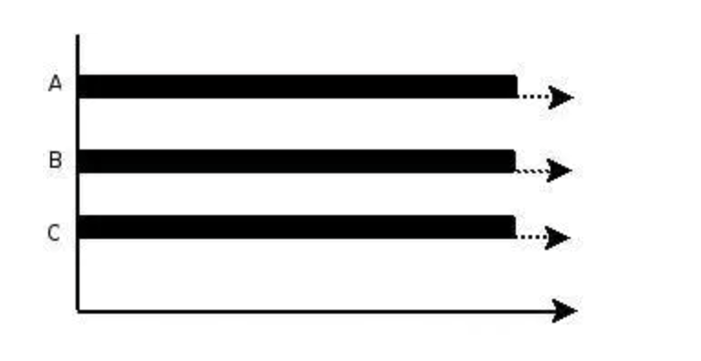

## 线程级并发

- 单CPU系统
    - 单CPU系统中，通过进程之间的并发可以设计出多个程序执行的系统
    - 通过线程之间的并发，可以在一个进程中执行多个控制流
- 多CPU系统(超线程+多核CPU)
    - 多核CPU

      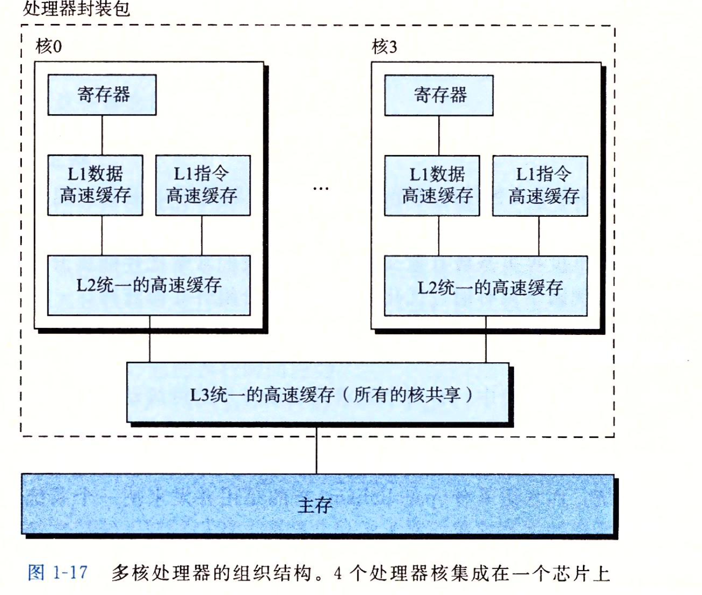

    - 超线程
        - 同时多线程，允许一个CPU执行多个控制流的技术
        - Intel Core i7 cpu可以让每个核执行两个线程，所以一个4核的系统实际上可以并行执行8个线程

## 指令级并发

一个指令的执行过程通常包括如下三个阶段：

- 取指令阶段
- 解码阶段
- 执行指令阶段

最初指令执行过程是每个指令经过一整个过程后，才运行下一条指令  
实际上每个阶段使用的是处理器中的不同硬件部分，这样子可以流水线的运行多条指令，达到差不多一个始终周期运行一条指令

- CPU顺序处理指令

  

- CPU并行处理指令

  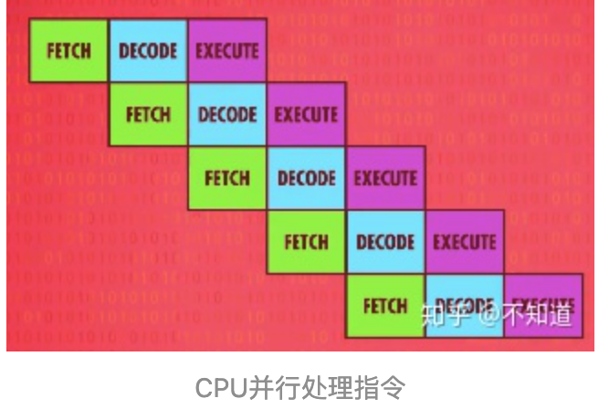

- 超标量处理器:处理器可以达到比一个周期一条指令更快的执行速率

  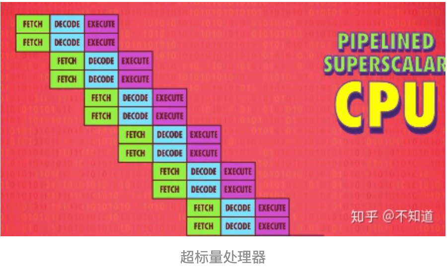

## 单指令、多数据并行

很多现代处理器拥有特殊的硬件，允许一条指令产生多个可以并行执行的操作，这种方式称之为单指令、多数据，即 `SIMD并行`

### Amdahl定律

Amdahl定律是对提升系统某一部分性能所带来的效果进行量化：当我们对系统某部分加速时，其对系统整体性能的影响取决于该部分的 `重要性` 和 `加速程度`

假设某应用程序原始执行时间T_old, 某部分所需执行时间与该时间的比例为a，该部分提升比例为k，则总执行时间为：


```
T_new = (1-a)T_old + aT_old/k = T_old[(1-a]+a/k]
加速比为 S = 1/[(1-a) + a/k]
当k趋向于无穷时，可以计算出该部分加速到极限时所能得到的加速比为：S=1/(1-a)
```

该定律提供一个主要观点： 要想显著加速整个系统，必须提升全系统中相当大的部分的速度

## 小结

- 计算机系统由硬件和系统软件组成，他们共同协作以运行应用程序
- 计算机内部信息被表示成一组组的位
- 程序被翻译成不同形式，开始是ASCII文本，然后被编译器和链接器翻译成二进制可执行文件
- 处理器读取并解释存放在主存里的二进制指令
- 主存、I/O设备和CPU寄存器之间复制数据，系统中的存储设备划分成了层次结构：CPU寄存器在顶部，接着是多层的硬件高速缓存存储器，DRAM主存和磁盘存储器
- 操作系统内核是应用程序和硬件之间的媒介，提供三个基本的抽象：1）文件是对I/O设备的抽象；2）虚拟内存是对主存和磁盘的抽象；3）进程是处理器、主存和I/O设备的抽象
- 网络提供了计算机系统之间通信的手段，从特殊系统的角度来看，网络是一种I/O设备


## 信息的表示和处理


## 程序的机器级表示

## 处理器体系结构

## 优化程序性能

## 存储器层次结构

## 链接

## 异常控制流

## 虚拟内存

## 系统级I/O

## 网络编程

## 并发编程
