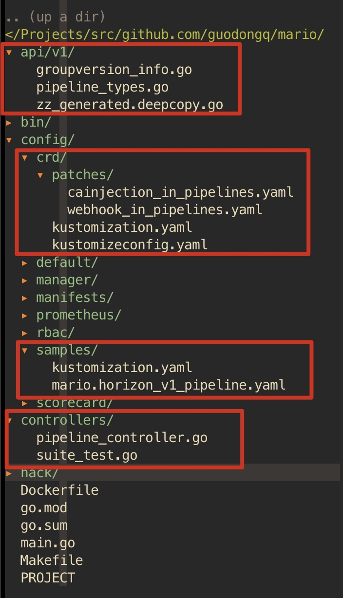
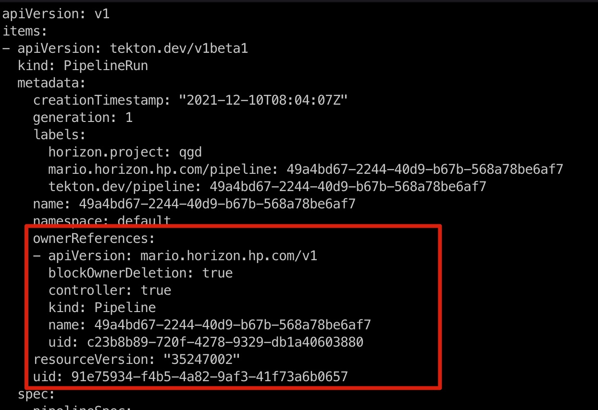

# 编写Kubernetes CRD扩展Kubernetes API

## 声明式编程

- 命令式编程：详细的命令机器怎么(How)去处理一件事情以达到你想要的结果(What)  
- 声明式编程：只告诉你想要的结果(What)，机器自己摸索过程(How)  

在Kubernetes中一般会编写对应API对象的YAML文件交给Kubernetes(而不是使用一些命令来直接操作API)，即只需要提交一个定义好的API对象来"声明"（这个YAML文件其实就是一种"声明"),表示所期望的最终状态是什么样子就可以了

用户只需要关心应用程序的最终状态，其他的都是通过K8s来帮助我们完成，通过这种声明式的方式可以大大简化应用的配置管理复杂度

## GVK&&GVR

在Kubernetes中想要完成一个CRD，需要指定 ``group/version`` 和 ``kind``, 在kuberntes的API Server中简称为GVK，GVK是定位一种类型的方式，例如daemonsets就是Kubernetes的一种资源，当我们想要通过Kubernetes创建一个daemonsets的时候，需要定义daemonsets的描述文件

```
apiVersion: apps/v1 
kind: DaemonSet
```

这里声明了apiVersion是 ``apps/v1``,其实隐含了Group是apps，Version是v1，Kind是定义的DaemonSet，而kubectl接收到这个声明以后，可以根据这个声明去调用API Server对应的URL去获取信息，本例中就是 ``/apis/apps/v1/daemonset``

Kubernetes组织资源的方式是以REST的URI形式的，而组织的路径就是：


在API Server中还有第二个概念GVR, 当我们理解了GVK之后，再来理解GVR就容易了，和面向对象编程中的类和对象的概念是一样的


|  Kubernetes   | OOP     |
| ---            |  ---    |
|  Kind         | Class   |
|  Resource     | Object  |

Kind其实就是一个类，用于描述对象的，而Resource就是具体的Kind，可以理解成类已经实例化成对象了

## 控制器模式

kubernetes作为一个“容器编排”平台，其核心的功能是编排，Pod作为K8s调度的最小单位，具备很多属性和字段，k8s编排正是通过一个个控制器根据被控制对象的属性和字段来实现。

K8s集群在部署时包含了Controllers组件，里面对于每个build-in的资源类型（比如Deployment、Statefulset、Cronjob…）都有对应的Controller，基本是1:1的关系

```
apiVersion: apps/v1 
kind: Deployment 
metadata: 
  name: test 
spec: 
  selector:
    matchLabels:
      app: test
  replicas: 2
  template:
    metadata:
      labels:
        app: test
    spec:
      containers:
      - name: nginx
        image: nginx:1.7.9
        ports:
        - containerPort: 80
```

如上，Deployment资源创建以后，对应的Deployment Controller确保当前的deployment资源的Pod个数永远为2，Pod由Template部分组成,具体来说K8s里面的kube-controller-manager这个组件在做这件事情，在 ``kubernetes/pkg/controller`` 目录下包含了所有的控制器，它们都以独有的方式负责某种编排功能，但是它们都遵循一个通用的编排模式，即：调谐循环(Reconcile loop),伪代码逻辑如下:

```
for {
 actualState := GetResourceActualState(rsvc) 
 expectState := GetResourceExpectState(rsvc)
 if actualState == expectState {
    // do nothing
 } else {
    Reconcile(rsvc)
 }
}
```

- 就是一个无限循环不断地对比期望状态和实际状态，如果有出入则进行Reconcile(调谐)逻辑将实际状态调整为期望状态  
- 期望状态就是我们对象的定义(通常是YAML文件),实际状态是k8s集群里面当前的运行状态  
- 控制器的编排逻辑主要是第三步做的，这个操作称为调谐(Reconcile),整个控制器的调谐过程称为"Reconcile Loop"


## 开发脚手架

* [code-generator](https://github.com/kubernetes/code-generator)
* [kubebuilder](https://github.com/kubernetes-sigs/kubebuilder)
* [operator-sdk](https://github.com/operator-framework/operator-sdk)

`code-generator` 实际上并不能称之为crd开发的脚手架，它只是能生成一些代码，如果用code-generator进行crd的开发需要手工编写很多代码

`kubebuilder` 和 `operator-sdk` 都是为了方便创建和管理operator而生的脚手架项目, `operator-sdk` 在底层使用了 `kubebuilder`,两者在创建operator项目时都是调用 `controller-runtime` 接口，具有相同的项目布局。

除此之外 `operator-sdk` 还增加了一些特性，具体可以 [参考](https://sdk.operatorframework.io/docs/faqs/)

* 两者不是竞争关系, `operator-sdk` 相当于是 `kubebuilder+`  
* `operator-sdk` 的文档质量高，感觉 `operator-sdk` 更像是商业版本的kubebuilder,实际上它们都是开源的 

## Operator SDK Getting Started

### 安装依赖

在开发CRD之前，需要安装一些工具，具体的可以 [参考](https://sdk.operatorframework.io/docs/building-operators/golang/installation/#additional-prerequisites) 

* operator-sdk  
* git  
* go  
* docker  
* kubectl  

### 创建脚手架工程

```
❯ mkdir mario
❯ cd mario
❯ pwd
/Users/qianguodong/Projects/src/github.com/guodongq/mario

❯ operator-sdk init --domain qgd.io --repo github.com/guodongq/mario

Writing kustomize manifests for you to edit...
Writing scaffold for you to edit...
Get controller runtime:
$ go get sigs.k8s.io/controller-runtime@v0.10.0
Update dependencies:
$ go mod tidy
Next: define a resource with:
$ operator-sdk create api

❯ tree -L 2
.
├── Dockerfile
├── Makefile
├── PROJECT
├── config
│   ├── default
│   ├── manager
│   ├── manifests
│   ├── prometheus
│   ├── rbac
│   └── scorecard
├── go.mod
├── go.sum
├── hack
│   └── boilerplate.go.txt
└── main.go

8 directories, 7 files
```


执行上面的命令后会生成基本的目录结构，对其中的每个目录解释如下

* Dockerfile 用于构建Docker镜像  
* Makefile  编译、构建、部署operator都会用到该文件  
* PROJECT 工程的元数据，在生成各种API的时候会用到这里面的信息
* config/default 基于kustomize制作的配置文件，为controller提供标准配置，也可以根据需要去修改调整  
* config/manager 和controller有关的细节配置，例如镜像的资源限制  
* config/manifests 基于kustomize方式管理operator生成的所有manifest
* config/rbac operator在kubernetes中的操作权限，通过rbac做精细的权限配置  
* config/scorecard 工具用来验证operator打包并运行测试  
* go.mod go语言依赖  
* hack/boilerplate.go.txt 生成的文件头部添加的license  
* main.go 主函数

 
### 创建API

```
❯ operator-sdk create api --group mario.horizon --version v1 --kind Pipeline --resource --controller
Writing kustomize manifests for you to edit...
Writing scaffold for you to edit...
api/v1/pipeline_types.go
controllers/pipeline_controller.go
Update dependencies:
$ go mod tidy
Running make:
$ make generate
go: creating new go.mod: module tmp
Downloading sigs.k8s.io/controller-tools/cmd/controller-gen@v0.7.0
go get: installing executables with 'go get' in module mode is deprecated.
    To adjust and download dependencies of the current module, use 'go get -d'.
    To install using requirements of the current module, use 'go install'.
    To install ignoring the current module, use 'go install' with a version,
    like 'go install example.com/cmd@latest'.
    For more information, see https://golang.org/doc/go-get-install-deprecation
    or run 'go help get' or 'go help install'.
go get: added github.com/fatih/color v1.12.0
go get: added github.com/go-logr/logr v0.4.0
go get: added github.com/gobuffalo/flect v0.2.3
go get: added github.com/gogo/protobuf v1.3.2
go get: added github.com/google/go-cmp v0.5.6
go get: added github.com/google/gofuzz v1.1.0
go get: added github.com/inconshreveable/mousetrap v1.0.0
go get: added github.com/json-iterator/go v1.1.11
go get: added github.com/mattn/go-colorable v0.1.8
go get: added github.com/mattn/go-isatty v0.0.12
go get: added github.com/modern-go/concurrent v0.0.0-20180306012644-bacd9c7ef1dd
go get: added github.com/modern-go/reflect2 v1.0.1
go get: added github.com/spf13/cobra v1.2.1
go get: added github.com/spf13/pflag v1.0.5
go get: added golang.org/x/mod v0.4.2
go get: added golang.org/x/net v0.0.0-20210520170846-37e1c6afe023
go get: added golang.org/x/sys v0.0.0-20210616094352-59db8d763f22
go get: added golang.org/x/text v0.3.6
go get: added golang.org/x/tools v0.1.5
go get: added golang.org/x/xerrors v0.0.0-20200804184101-5ec99f83aff1
go get: added gopkg.in/inf.v0 v0.9.1
go get: added gopkg.in/yaml.v2 v2.4.0
go get: added gopkg.in/yaml.v3 v3.0.0-20210107192922-496545a6307b
go get: added k8s.io/api v0.22.2
go get: added k8s.io/apiextensions-apiserver v0.22.2
go get: added k8s.io/apimachinery v0.22.2
go get: added k8s.io/klog/v2 v2.9.0
go get: added k8s.io/utils v0.0.0-20210819203725-bdf08cb9a70a
go get: added sigs.k8s.io/controller-tools v0.7.0
go get: added sigs.k8s.io/structured-merge-diff/v4 v4.1.2
go get: added sigs.k8s.io/yaml v1.2.0
/Users/qianguodong/Projects/src/github.com/guodongq/mario/bin/controller-gen object:headerFile="hack/boilerplate.go.txt" paths="./..."
Next: implement your new API and generate the manifests (e.g. CRDs,CRs) with:
$ make manifests
```


项目中自动增加了很多内容，如下图所示



* 新增加的内容中，最核心的是CRD了，也就是上图中Pipeline数据结构所在的 `pipeline_types.go`, 这个最重要的数据结构如下

```
// Pipeline is the Schema for the pipelines API
type Pipeline struct {
  metav1.TypeMeta   `json:",inline"`
  metav1.ObjectMeta `json:"metadata,omitempty"`

  Spec   PipelineSpec   `json:"spec,omitempty"`
  Status PipelineStatus `json:"status,omitempty"`
}
```

* metav1.TypeMeta: 保存资源的Group、Version、Kind  
* metav1.ObjectMeta: 保存资源对象的名称和namespace  
* Spec: 期望状态  
* Status: 实际状态  
* 还有一个数据结构就是Pipeline对应的列表PipelineList,就是单个资源对象的集合

### 定义CRD

在operator-sdk生成的项目结构中的 ``pipeline_types.go`` 文件中定义Spec和Status

### 编写Controller逻辑
 
在operator-sdk生成的项目结构中的 ``pipeline_controller.go`` 文件中实现Reconcile的逻辑

### 测试发布

本地调试以后，可以使用Makefile构建镜像，部署我们的CRDs和Controller即可

* make docker-build IMG=imbruce/mario:v1.0.23
* make docker-push IMG=imbruce/mario:v1.0.23  
* make deploy IMG=imbruce/mario:v1.0.23

### Local Debug

CRD controller是通过API Server来观察ETCD中CR资源的变化产生的事件，从而进行Reconcile调谐逻辑，实际上我们可以在本地进行crd controller的调试

当需要在本地进行调试时，需要做如下步骤

* export KUBECONFIG=***  指定使用的k8s的kubeconfig文件  
* make install  将CRD定义安装到Kubernetes Cluster之中
* 本地启动crd controller即可


## 总结

### operator-sdk编写crd的流程

* 使用operator-sdk创建一个新的Operator项目  
* 添加自定义资源(CRD)定义新的资源API  
* 丰富完善CRD的结构定义
* 定义Operator的调谐(reconcile)逻辑  
* 使用Operator SDK构建并生成Operator部署清单文件  
* 部署CRD到Kubernetes Cluster中

### 如何自定义显示列?
从1.11以后, ``kubectl get`` 可以增加显示的列,通过标记 ``+kubebuilder:printcolumn`` 进行添加

### 如何通过rbac添加权限？

如下图Reconcile方法前面有一些  ``+kubebuilder:rbac`` 的前缀，这些是用来确保controller在运行时有相应的资源操作权限


### 如何对字段添加校验?

使用注解 ``+kubebuilder:validation:***`` 对需要的字段添加校验规则,具体可以 [参考](https://book.kubebuilder.io/reference/markers/crd-validation.html)


### Reconcile方法什么时候被调度?

- For: 当监控的资源发生变化时  
- Owns: 当从属的资源发生变化时


### Reconcile方法什么时候被再次调度?

通过查看Reconcile的源码，发现当如下条件发生时，reconcile方法会被再次调度起来  

* 返回错误： return reconcile.Result{}, err  
* 没有error，显式指定放到队列中: return reconcile.Result{Requeue: true}, nil  
* 没有error，显式指定下一次触发的时间，一般用在cronjob中： return reconcile.Result{RequeueAfter: time.Second}, nil  

PS: 如果想要终止Reconcile逻辑，请返回 return reconcile.Result{}, nil


### 当删除CR资源时，被CR管理的其他资源怎样同时被删除?

当我们创建一种资源的时候，顺带着会创建一些其他的资源，例如 eployment会创建Replicaset，replicaset会创建Pod  
当我们删除某种资源时，其他顺带创建的资源也一并删除，使用OwnReference进行垃圾清理


