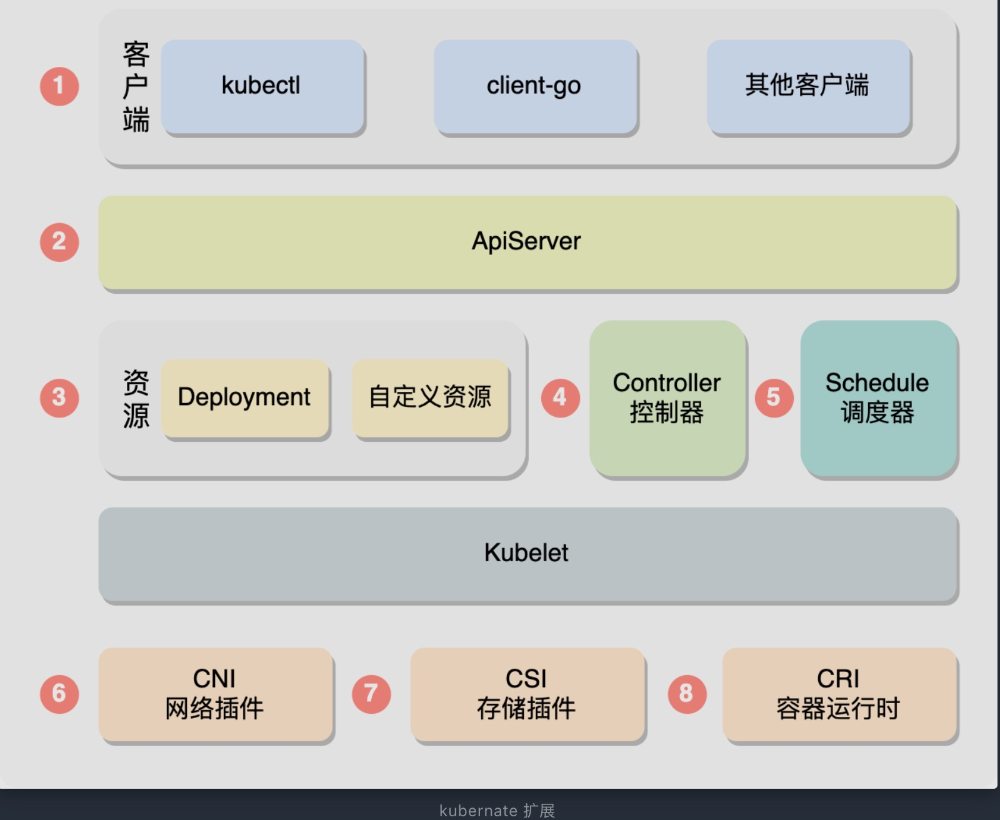
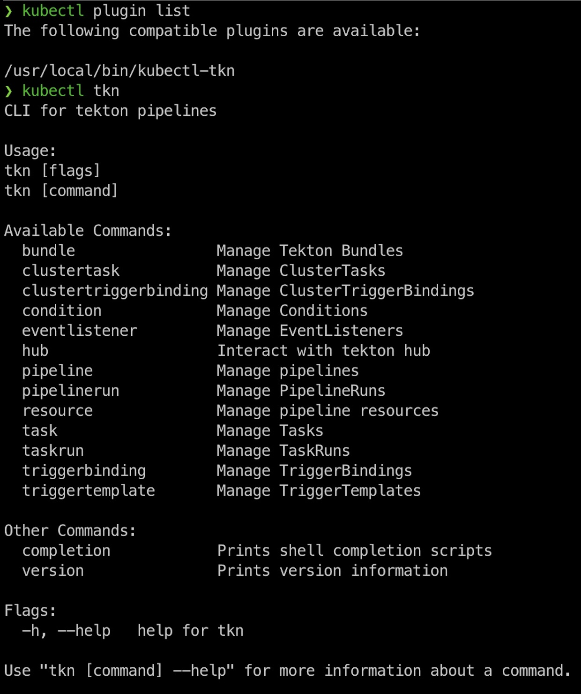
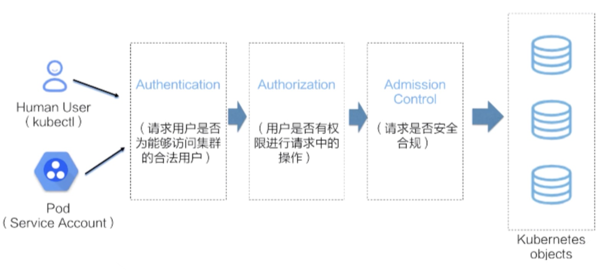
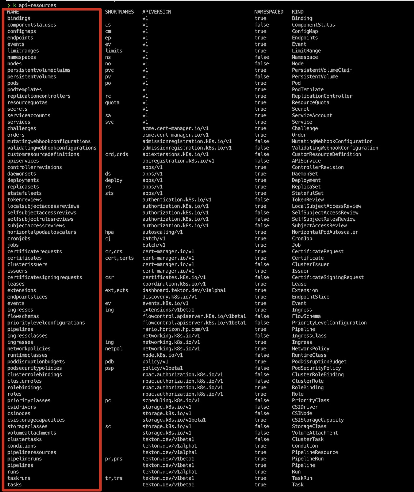

# Kubernetes扩展

目前Kubernetes已经成为容器编排的事实标准，其本身的功能也是非常丰富并且灵活，但是也不能满足所有人的需求。在遇到Kubernetes提供的能力无法满足我们需求的时候，我们可以利用Kubernetes高度可配置且可扩展的能力进行定制。

Kubernetes的定制化方法主要分为配置和扩展两种，这里主要讲述Kubernetes扩展，实际上从客户端到底层容器运行时，绝大部分地方Kubernetes都为我们预留了扩展点



## Kubectl

用户通常使用kubectl与Kubernetes API交互。[Kubectl插件](https://kubernetes.io/zh/docs/tasks/extend-kubectl/kubectl-plugins/) 能够扩展Kubectl的行为，不过这些插件只会影响到每个用户的本地环境


Kubectl将会在用户的PATH路径下查找 ``kubectl-*`` 为前缀的二进制文件，并且把它当成一个插件.

例如tekton的cli命令行工具，可以作为一个kubectl插件[kubectl-tkn](https://github.com/tektoncd/cli#tkn-as-a-kubectl-plugin) 方式运行




有一些写好的kubectl plugins可供我们使用，更多信息请访问[这里](https://krew.sigs.k8s.io/plugins/)


## ApiServer

APIServer处理所有的请求，当请求到达APIServer时，需要经过认证->鉴权->准入控制的步骤，在这些步骤中都存在扩展点



## 准入控制

用的最多的是准入控制的扩展，准入控制会先经过变更准入控制MutatingAdmissionWebhook，然后再经过验证准入控制ValidatingAdmissionWebhook,任何一个准入控制器返回了错误这个请求都会失败，在这两个准入控制器中可以做很多事情，例如注入sidecar，验证资源，调整pod的配额等等

- [Kubernetes API访问扩展](https://kubernetes.io/zh/docs/concepts/security/controlling-access/)
- [深入理解k8s中的访问控制](https://www.cnblogs.com/yangyuliufeng/p/13548915.html)

## Aggregation Layer

从K8s 1.7版本之后，APIServer引入了聚合层的功能，API Aggregation允许在不修改Kubernetes核心代码的同时扩展Kubernetes API，即将第三方服务注册到Kubernetes API中，这样就可以通过Kubernetes API来访问外部服务


例如：将如下的资源提交给K8s以后，当用户在访问ApiServer的/apis/metrics.kubernetes.io/v1beta1路径时，会被转发到集群中的metrics-server.kube-system.svc服务上

```
apiVersion: apiregistration.Kubernetes.io/v1
kind: APIService
metadata:
name: v1beta1.metrics.Kubernetes.io
spec:
service:
    name: metrics-server
    namespace: kube-system
group: metrics.Kubernetes.io
version: v1beta1
insecureSkipTLSVerify: true
groupPriorityMinimum: 100
versionPriority: 100
```


- [Kubernetes API Aggregator是什么](https://blog.51cto.com/wzlinux/2474075)
- [Kubernetes扩展apiserver实现分析](https://qingwave.github.io/kube-apiserver-aggretation-api/)
- [Kube-Aggregator](https://github.com/kubernetes/kube-aggregator)


## 资源

我们常用的 ``Deployment``, ``Pod``, ``Node`` 等都是K8s官方提供的内置资源，但是有时候内置资源无法满足我们的需求时，就可以使用CustomResource，即自定义资源

CR常常会和controller一起配合使用




## 控制器

Kubernetes中资源的状态的维护都是Controller来实现的，controller会不断尝试将一个资源调整为我们描述的状态，即常说的声明式api

声明式API背后具体的活都是controller干的，controller一般会配合着CRD一起使用


## 调度器

Kubernetes调度器负责决定Pod要放置到哪些节点上执行

调度器是一种特殊的控制器，负责监视Pod变化并将Pod分派给节点。默认的调度器可以被整体替换掉或者是使用多个调度器

除此之外，官方默认的调度器也支持WebHook


- [调度器扩展](https://kubernetes.io/zh/docs/concepts/extend-kubernetes/#scheduler-extensions)
- [Kubernetes Scheduler](https://github.com/kubernetes/kubernetes/tree/master/pkg/scheduler)


## 网络插件CNI

CNI网络插件，全称Container Network Interface(容器网络接口)，由一组用于配置Linux容器的网络接口的规范和库组成，同时还包含一些插件

CNI仅关心容器创建时的网络分配，和当容器被删除时释放网络资源

- [CNI容器网络接口](https://jimmysong.io/kubernetes-handbook/concepts/cni.html)
- [Container Network Interface](https://github.com/containernetworking/cni)


## 存储插件CSI

全称是Container Storage Interface，可以通过CSI接口支持不同的存储类型


推荐一个动态自动创建本地目录作为持久化目录的provisioner [rancher/local-path-provisioner](https://github.com/rancher/local-path-provisioner)


- [搞定持久化存储](https://www.infoq.cn/article/pdsrqaer3mkovsmgoovs)
- [PV/PVC/StorageClass/Provisioner](https://mp.weixin.qq.com/s?__biz=MzIyMTUwMDMyOQ==&mid=2247489580&idx=1&sn=8d6f118e3bd4cd726a61cd017a2c984e&chksm=e83a9eeadf4d17fcafd7c50b7444a9140a8b710707739fd1bd35fa498366c18c5b39642fac40&scene=21#wechat_redirect)
- [rancher provisioner](https://izsk.me/2020/07/24/Kubernetes-Rancher-local-path-provisioner/)
- [容器存储接口](https://jimmysong.io/kubernetes-handbook/concepts/csi.html)
- [CSI插件编写指南](https://time.geekbang.org/column/article/64392)
- [csi-spec](https://github.com/container-storage-interface/spec/blob/master/spec.md)
- [使用CSI和Kubernetes实现卷的动态扩容](https://kubernetes.io/zh/blog/2018/08/02/%E4%BD%BF%E7%94%A8-csi-%E5%92%8C-kubernetes-%E5%AE%9E%E7%8E%B0%E5%8D%B7%E7%9A%84%E5%8A%A8%E6%80%81%E6%89%A9%E5%AE%B9/)

## 容器运行时CRI


全称Container Runtime Interface,是一组用于管理容器运行时和镜像的gRPC接口，利用这个接口可以支持docker，containerd等不同的容器运行时

- [Container Runtime Interface](https://jimmysong.io/kubernetes-handbook/concepts/cri.html)
- [CRI](https://feisky.gitbooks.io/kubernetes/content/plugins/CRI.html)
