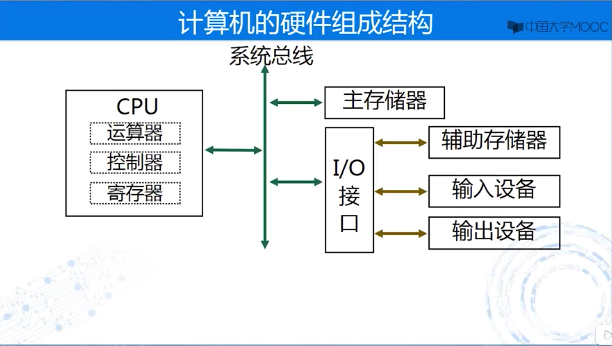
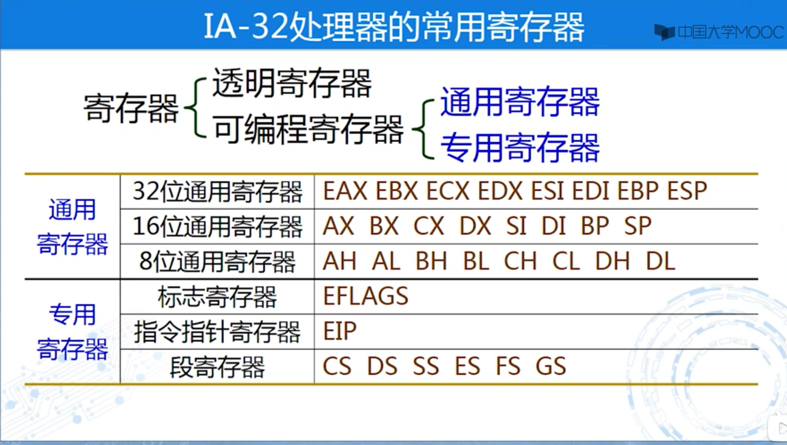
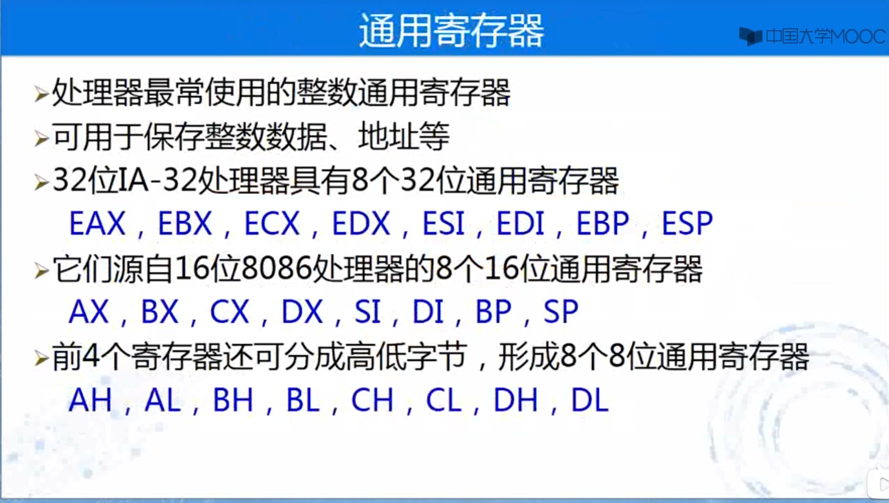

.. SPDX-License-Identifier: MIT

====================
汇编语言程序设计
====================

计算机硬件组成结构
------------------



- 处理器子系统
- 存储器子系统
- I/O设备子系统

汇编语言程序员将硬件抽象为：
- 寄存器
- 存储器地址
- 输入输出地址

寄存器(Register)
-----------------

- 处理器内部的高速存储单元
- 用于暂时存放程序执行过程中的代码和数据


有如下两类寄存器

- 透明寄存器：对应用人员不可见、不能编程直接控制
- 可编程(Programmable)寄存器：具有引用名称、供编程引用
    - 通用寄存器(General-Purpose Register)
    - 专用寄存器



通用寄存器
```````````


- 16位扩展(Extended)为32位

  .. image:: assets/16位扩展为32位.png

- 前4个分为高(High)低(Low)字节

  .. image:: assets/前4个分为高低字节.png

- 通用寄存器的名称

  +------------+-------------------+---------------+
  | 寄存器简写 | 英文全称          | 中文全称      |
  +============+===================+===============+
  | EAX        | Accumulator       | 累加器        |
  +------------+-------------------+---------------+
  | EBX        | Base Address      | 基址寄存器    |
  +------------+-------------------+---------------+
  | ECX        | Counter           | 计数器        |
  +------------+-------------------+---------------+
  | EDX        | Data              | 数据寄存器    |
  +------------+-------------------+---------------+
  | ESI        | Source Index      | 源变址寄存器  |
  +------------+-------------------+---------------+
  | EDI        | Destination Index | 目的变址寄存器|
  +------------+-------------------+---------------+
  | EBP        | Base Pointer      | 基址指针      |
  +------------+-------------------+---------------+
  | ESP        | Stack Pointer     | 堆栈指针      |
  +------------+-------------------+---------------+

## 专用寄存器
### 标志寄存器
#### 什么是标志(Flag)
- 标志体现了某种工作标志
- 有些处理器标志用于反映指令执行结果
  - 加减是否进借位，数据是否为零，或者是正还是负
- 有些处理器标志用于控制指令执行形式
  - 处理器是否单步操作，是否响应外部中断
- 设计一个或多个二进制位表示一种标志
- 用0和1的不同组合表达标志的不同状态

#### 什么是标志寄存器
- 各种标志组合在一个专用寄存器形成标志寄存器
- 8086支持16位标志寄存器FLAGS
- IA-32处理器形成32位EFLAGS标志寄存器
  - 状态标志：记录指令执行结果的辅助信息
  - 控制标志：方向标志DF，仅用于串操作指令
  - 系统标志：控制操作系统或核心管理程序的操作方式


#### 状态标志：处理器最基本的标志
- 用来记录指令执行结果的辅助信息
- 加减运算和逻辑运算指令主要设置它们
- 其他有些指令的执行也会相应的设置它们
- 处理器主要使用其中5个构成各种条件
  - 分支指令判断这些条件实现程序分支

### 指令指针寄存器EIP
- 保存将要执行的指令在主存的存储器地址
  - 顺序执行时自动增量(加上该指令的字节数)
    指向下一条指令
  - 分支、调用等操作时执行控制转移指令修改
    引起程序转移到指定的指令执行
  - 出现中断或异常时被处理器赋值而相应改变


### 段寄存器


# 存储器组织
## 存储器地址
- 主存储器容量很大，被划分成许多存储单元
- 每个存储单元被编排一个号码，即存储单元地址
   - 称为存储器地址Memory Address
- 每个存储单元以字节为基本存储单位
   - 即字节编址(Byte Addressable)
   - 一个字节(Byte)等于8个二进制位(Bit)
   - 二进制位是计算机存储信息的最小单位


```
1Byte=8Bit
1KB=1024Byte=2^10
1M=1024KB=2^20
1G=1024M=2^30
4G=2^30*2^2=2^32
```

## 存储器的物理地址


## 存储模型


### IA-32处理器的存储模型


## 存储空间分段管理
- 段是保存相关代码或数据的一个主存区域
- 应用程序主要涉及三类基本段
  - 代码段（Code Segment）
    存放程序的可执行代码（处理器指令）
  - 数据段（Data Segment）
    存放程序所用的数据，例如全局变量
  - 堆栈段（Stack Segment）
    程序需要的特殊区域，存放返回地址、临时变量等


## 逻辑地址（Logical Address）
- 存储器空间可以分段管理，采用逻辑地址指示
- 逻辑地址=段基地址：偏移地址
  - 段基地址=在主存中的起始地址
  - 偏移地址=距离段基地址的位移量
- 处理器内部以及程序员编程时采用逻辑地址


